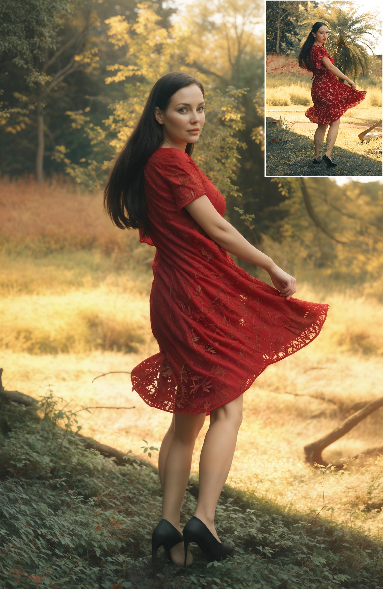
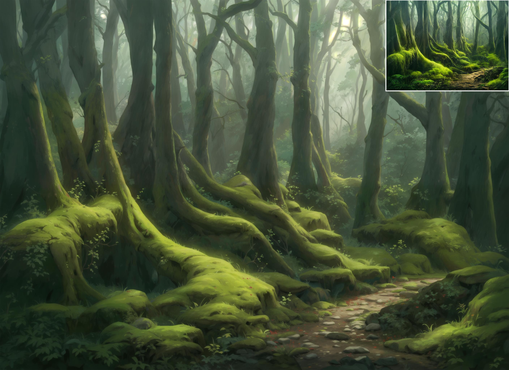
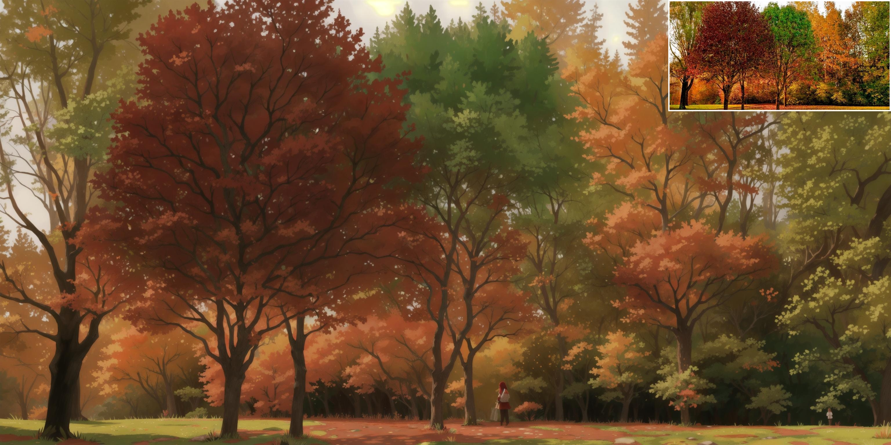
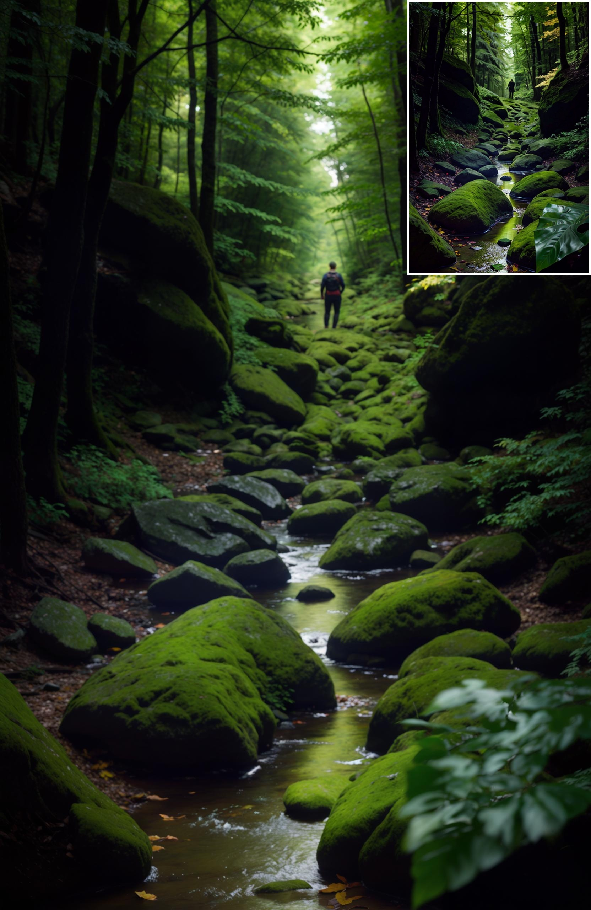
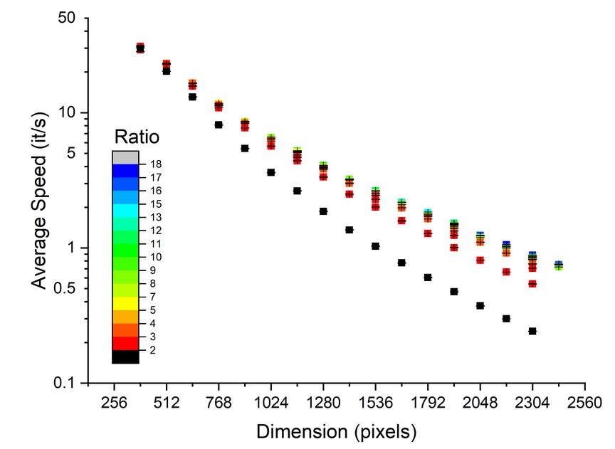
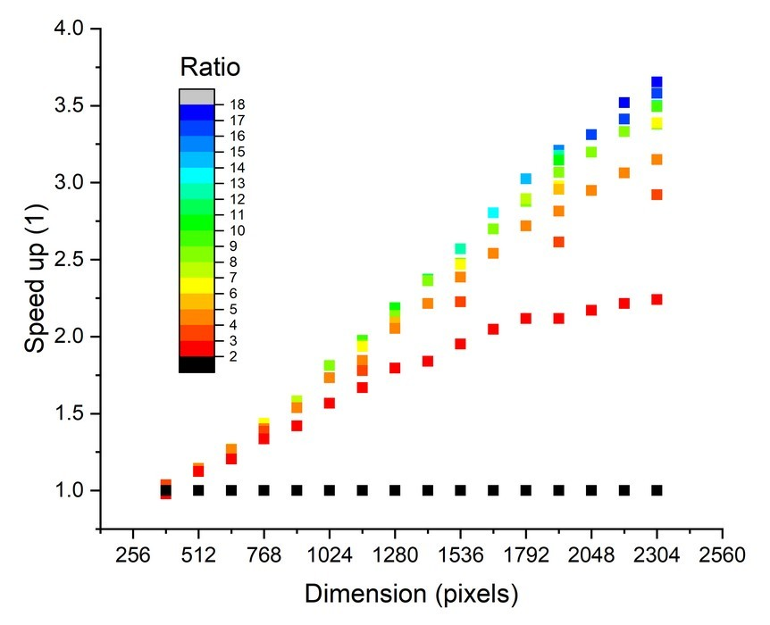

# HyperTile: Tiled-optimizations for Stable-Diffusion

HyperTile optimizes the self-attention layer within the Stable-Diffusion U-Net and VAE models, resulting in a reduction in computation time ranging from 1 to 4 times, depending on the initial resolution and tile size. The implementation is **exceptionally** straightforward.

To get started with HyperTile and experiment using the Jupyter notebook, follow these steps:

1. Clone the repository:

```bash
git clone https://github.com/tfernd/HyperTile
cd HyperTile
```

2. Open the Jupyter notebook `playground.ipynb` (install _jupyter_ if you don't have it instaled already).

```bash
jupyter-notebook playground.ipynb
```

Alternatively, you can install HyperTile using pip:

```bash
pip install git+https://github.com/tfernd/HyperTile
```

## Interested in Integrating It into Your Preferred Web UI?

You can seamlessly incorporate this functionality with just three lines of code:

```python
from hyper_tile import split_attention

with split_attention(vae, height, width, vae_chunk):
    with split_attention(unet, height, width, unet_chunk):
        # Continue with the rest of your code, including the diffusion process
```

By adjusting the `vae_chunk` and `unet_chunk` sizes, you can fine-tune your setup according to your specific requirements. For Stable-Diffusion 1.5, it's advisable to keep the chunk size at 256 or 384 for the U-Net, and 128 for VAE.

## Examples

All examples were from images found on the internet or generations of mine. It was upscaled with a loopback=2, and strength between 0.3 and 0.4.

**Note**: The only reason why I'm using loopback, is because I'm using a naive upscaler from PIL (Lanczos), which make images very blurry.

Woman in a dress: 512x768 -> 1664x2560


Forest 1: 681x503 -> 2816x2048


Forest 2: 768x384 -> 3072x1536


Forest 3: 512x768 -> 1664x2560


## Performance

In this performance evaluation, I conducted three image generation experiments, each consisting of 30 steps. I used the diffusers backend in PyTorch 2.0.1, with the assistance of [SDPA](https://pytorch.org/tutorials/intermediate/scaled_dot_product_attention_tutorial.html). The images generated are square, and their dimensions vary along the x-axis. The black dots represent speed measurements without tiling, while all other colored dots consist of tiles, with each dot corresponding to a specific ratio of the dimension (size/chunk), maintaining a minimum tile size of 128.



The subsequent graph illustrates the speed-up achieved for each tile-ratio. As the target image dimension increases, the potential speed-up becomes more substantial.



It's important to note that, currently, I have exclusively tested with the diffusers backend due to its superior performance. Additionally, there is currently no LoRA model available for HD resolution that is compatible with diffusers. Consequently, text-to-image generation, whether tiled or non-tiled, may exhibit aberrations. Addressing this issue necessitates the development of a fine-tuned LoRA model specifically tailored for high-resolution images with a Hyper-Tiled enabled.

## Limitations

- Stable-Diffusion's training data is based on 512 x 512 images, limiting its effectiveness for larger images. However, you can use an image-to-image approach with reduced `strength` to add details to larger images, especially beneficial when achieving a 3-4 times speed-up for very large images, typically in the 3-4K resolution range.

- When working at 4K resolution with 16 GB VRAM, the diffusion process functions properly. However, the VAE implementation within `diffusers` struggles to decode the latents, even with the sliced-vae option enabled, resulting in out-of-memory errors. Further investigation into this issue is warranted.

- In some cases, you may notice soft tiles in the images, which are not conventional hard tiles. These soft tiles may contain more detail. One potential mitigation strategy is to alternate the tile sizes. For example, use a set of smaller tiles initially and then gradually transition to slightly larger ones. Alternatively, consider using larger tiles at the beginning and smaller ones towards the end of the process. This approach is still under exploration for optimization.

## Future

- Try to tile the second depth of the U-Net, using bigger chunks, or training an LoRA to remove problems. Is it worth it?

- Identify other areas of the U-Net that can be tiled.

- Tile Rotation: With each function call, a varying tile size is employed to prevent any overlap-related concerns in some special circunstances.
